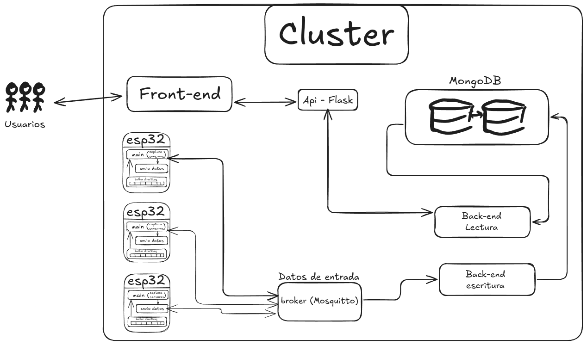

# Sistema de Hidroponía Urbana



## 📋 Descripción del Proyecto y Objetivo a largo plazo

Sistema distribuido de monitoreo y control para hidroponía urbana que integra dispositivos IoT (ESP32), y una interfaz web. La plataforma permite el monitoreo en tiempo real de parámetros de cultivos hidropónicos a través de una arquitectura de microservicios desplegada en Kubernetes. La misma esta desarrollada para ser implementada en la ciudad de Mendoza con la intencion de poder registrar datos correspondientes a los cultivos y evaluar a largo plazo la posibilidad de eliminar islas de calor en zonas urbanas mediante la implementacion de este sistema  

## 🏗️ Arquitectura del Sistema

El sistema está compuesto por los siguientes componentes:

### Componentes Principales
- **Frontend Web**: Interfaz de usuario desarrollada en Flask
- **API de Lectura**: Microservicio para consulta de datos históricos
- **API de Escritura**: Microservicio para ingesta de datos de sensores
- **Broker MQTT**: Mosquitto para comunicación IoT
- **Simuladores ESP32**: Emulación de dispositivos IoT
- **Base de Datos**: MongoDB para almacenamiento persistente

### Flujo de Datos
1. Los dispositivos ESP32 (simulados) envían datos de sensores vía MQTT
2. El backend de escritura procesa y almacena los datos en MongoDB
3. El frontend consulta datos históricos a través del API de lectura
4. Los usuarios interactúan con el sistema mediante la interfaz web

## 🛠️ Tecnologías Utilizadas

- **Orquestación**: Kubernetes + Minikube
- **Contenedores**: Docker
- **Backend**: Python + Flask
- **Base de Datos**: MongoDB
- **Broker MQTT**: Eclipse Mosquitto
- **IoT**: ESP32 (simulado)
- **Configuración**: Kustomize

## 🚀 Instalación y Configuración

### Prerrequisitos

1. **Minikube** instalado y configurado
```bash
# Instalar Minikube (Ubuntu/Debian)
curl -LO https://storage.googleapis.com/minikube/releases/latest/minikube-linux-amd64
sudo install minikube-linux-amd64 /usr/local/bin/minikube
```

2. **kubectl** instalado
```bash
# Instalar kubectl
curl -LO "https://dl.k8s.io/release/$(curl -L -s https://dl.k8s.io/release/stable.txt)/bin/linux/amd64/kubectl"
sudo install -o root -g root -m 0755 kubectl /usr/local/bin/kubectl
```

3. **Docker** instalado y funcionando
```bash
# Verificar Docker
docker --version
```

### Configuración Inicial

1. **Iniciar Minikube**
```bash
# Iniciar Minikube
minikube start
```

2. **Verificar el estado del cluster**
```bash
# Verificar que Minikube esté corriendo
minikube status
```

## 🎯 Despliegue del Sistema

### Opción 1: Despliegue Automático (Para Linux)

Utiliza el script de despliegue automatizado:

```bash
# Dar permisos de ejecución al script
chmod +x deploy_script.sh

# Ejecutar el despliegue
./deploy_script.sh
```

El script realizará automáticamente:
- ✅ Verificación de Minikube
- 📁 Creación de directorios necesarios
- ⚙️ Aplicación de configuraciones con Kustomize
- 🔍 Verificación del estado del despliegue

### Opción 2: Despliegue Manual

Si prefieres ejecutar paso a paso:

```bash
# 1. Verificar que Minikube esté corriendo
minikube status

# 2. Crear el directorio de datos en Minikube
minikube ssh -- 'sudo mkdir -p /mnt/data && sudo chmod 777 /mnt/data'

# 3. Aplicar todas las configuraciones
kubectl apply -k .

# 4. Verificar el despliegue
kubectl get pods -n hydroponics
kubectl get services -n hydroponics
kubectl get pvc -n hydroponics
```

## 🌐 Acceso a la Aplicación

### Frontend Web
```bash
# Obtener la URL del frontend
minikube service flask-frontend-service -n hydroponics --url
```

## 🔧 Comandos Útiles

### Monitoreo en Tiempo Real
```bash
# Ver pods en tiempo real
watch kubectl get pods -n hydroponics
```

### Escalado de Servicios
```bash
# Escalar simuladores ESP32
kubectl scale deployment esp32-simulators --replicas=5 -n hydroponics
```

## 🗑️ Limpieza del Sistema

### Eliminar el Despliegue
```bash
# Eliminar todos los recursos del proyecto
kubectl delete -k .

# O eliminar el namespace completo
kubectl delete namespace hydroponics
```
### Detener Minikube
```bash
# Detener Minikube
minikube stop

# Eliminar el cluster (opcional)
minikube delete
```

## 📝 Notas Técnicas

- El sistema utiliza **NodePort** para exponer servicios en Minikube
- MongoDB está configurado como **StatefulSet** para persistencia
- El broker MQTT soporta tanto protocolo MQTT como WebSockets pero no es aplicado de momento
- Se utiliza **PersistentVolume** local para almacenamiento en Minikube

---

**Desarrollado por**: Mangione Gabriel & Olivares Agustin  
**Curso**: Sistemas Distribuidos 2025 - FING  
